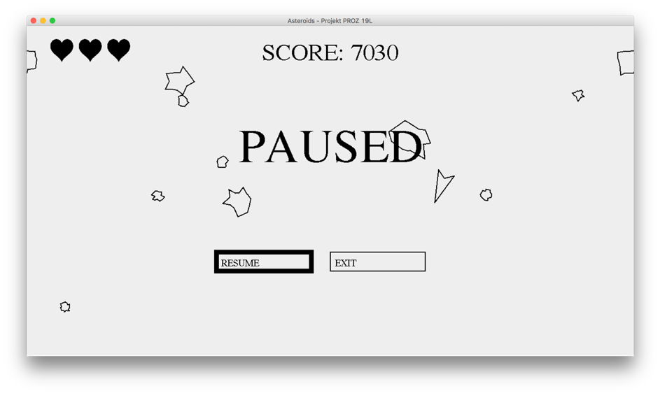

[EN]
# Project for 'Event-Driven Programming' course on WUT
# ASTEROIDS GAME
## Robert Dudziński

[Gameplay on Youtube](https://youtu.be/-0PF6T1UkMw)

## MENU NAVIGATION

Use arrows or WSAD keys to navigate menus. The program highlights currently selected button. Press ENTER to choose selected button.

## MAIN MENU

The main menu alllows the user to start a new game or exit the program.

## GAMEPLAY

## STEERING

- W – forward thrust
- S – backward thrust (it's weaker than forward thrust)
- A – turn left
- D – turn right
- SPACE – use weapon
- ESC – pause

## Using weapons

Use SPACE to fire a weapon. Depending on a weapon there are two fire modes: single and continuous. Single shoot is invoked after every time the SPACE is pressed. In addition, every weapon could have minimal interval time between next shoots (this applies to both: single and continuous fire).

## Pause

Press ESC key to pause a gameplay. The pause menu allows the user to continue the gameplay or to return to the main menu.

## GAME

Player's spaceship always spots in the center of the screen. At the beginning of each level, asteroids are generated at screen's edges. To enter next level player has to destroy all asteroids at the current level. Every next level generates one asteroid more and the player's weapon changes.

Available weapons (the left one insists in two variants: with single and continuous fire mode)

To destroy an asteroid, the player has to hit it with a bullet. There are few sizes of asteroids. All asteroids instantiate with the largest size. After hitting an asteroid, whose size is not the smallest, it's going to be splitted into two smaller asteroids.

By completing levels, the player can get additional lives (the player can have maximum 5 lives).

## POINTS

The player gets points for destroying asteroids and for completing next levels. The smaller a destroyed asteroid was, the more points the player gets. 

## UI

Number of hearts in the top-left corner indicates how many times the player could crash into asteroids.

In the middle, the current score is displayed.

## GAME OVER

At start, the player gets 3 lives. After collision with an asteroid, the player loses one live and reborns in the center of the screen. After every rebirth, the player blinks for few seconds - a collision with the player is disabled, so the player is not able to be reborn at an asteroid and immediately die. After losing all lives, the game is over. The user can play the game again or return to the main menu.

[PL]
# Projekt PROZ 19L
# ASTEROIDS – DOKUMENTACJA
## Robert Dudziński

[Nagrana rozgrywka na Youtubie](https://youtu.be/-0PF6T1UkMw)

## PORUSZANIE SIĘ PO MENU

W menu można się poruszać za pomocą strzałek lub klawiszy WSAD. Program zaznacza aktualnie wybrany przycisk – można go wybrać poprzez wciśnięcie klawisza ENTER.

## MENU GŁÓWNE

Menu główne pozwala rozpoczynać nową grę jak i umożliwia wyjście z programu. 

## ROZGRYWKA

## STEROWANIE

- W – uruchom ciąg do przodu
- S – uruchom ciąg do tyłu (jest mniejszy niż ciąg do przodu)
- A – obróć statek w lewo
- D – obróć statek w prawo
- SPACJA – korzystanie z broni
- ESC – pauza gry

## Korzystanie z broni

Za pomocą spacji można strzelać. W zależności od broni możliwy jest jeden z dwóch trybów ognia: pojedynczy i ciągły. Przy strzałach pojedynczych każdy wystrzał jest spowodowany przez wciśnięcie spacji. Dodatkowo każda broń może mieć minimalny czas, który musi minąć, aby móc oddać kolejny strzał (dotyczy to zarówno broni ze strzałami pojedynczymi jak i automatycznymi). 

## Pauza gry

Wciskając klawisz ESC można zapauzować rozgrywkę – gra zostaje zatrzymana aż do momentu wybrania przycisku do kontynuacji gry lub do wyjścia do menu głównego.

## PRZEBIEG GRY

Statek gracza zawsze pojawia się na środku ekranu. Na początku każdego poziomu generują się asteroidy na brzegu ekranu. Do kolejnego poziomu przechodzi się poprzez zniszczenie wszystkich asteroid na obecnym poziomie. Na każdym kolejnym poziomie generuje się jedna więcej asteroida oraz zmienia się broń.

Dostępne bronie (broń po lewej występuje w wariantach: strzelanie automatyczne i pojedyncze)

Aby zniszczyć asteroidę, należy trafić ją pociskiem. Jest kilka rozmiarów asteroid. Na samym początku generują się tylko duże asteroidy. Gdy trafi się w asteroidę, która nie jest najmniejszego rozmiaru to rozpada się ona na dwie asteroidy o mniejszym rozmiarze.

Gracz przechodząc na kolejne poziomy może dostać dodatkowe życia (ale nie może mieć więcej żyć niż 5).

## PUNKTACJA

Gracz otrzymuje punkty za niszczenie asteroid oraz za przechodzenie na następne poziomy. Im mniejsza asteroida została zniszczona tym więcej punktów się dostaje. Im na dalszy poziom się przechodzi tym więcej punktów dostaje gracz.

## UI

W lewym górnym rogu wyświetlają się serduszka, których ilość oznacza, ile razy gracz jeszcze może się rozbić o asteroidę.

Po środku na górze znajduję się aktualny wynik.

## KONIEC GRY

Gracz rozpoczyna grę mając 3 życia. Po kolizji z asteroidą gracz traci jedno życie i odradza się na środku ekranu. Przez kilka sekund statek gracza miga – jest to czas, w którym kolizja dla statku jest wyłączona przez co nie występuje sytuacja, że gracz odrodzi się na asteroidzie i od razu zginie. Po straceniu wszystkich żyć, gra kończy się. Można rozpocząć grę od początku lub wrócić do głównego menu.

