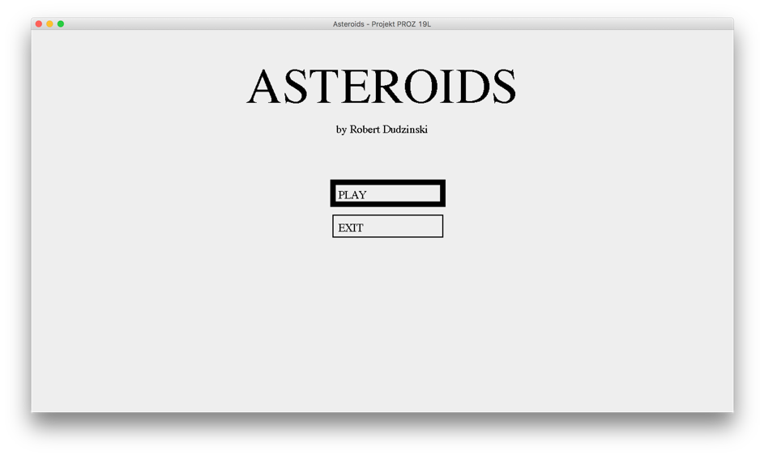
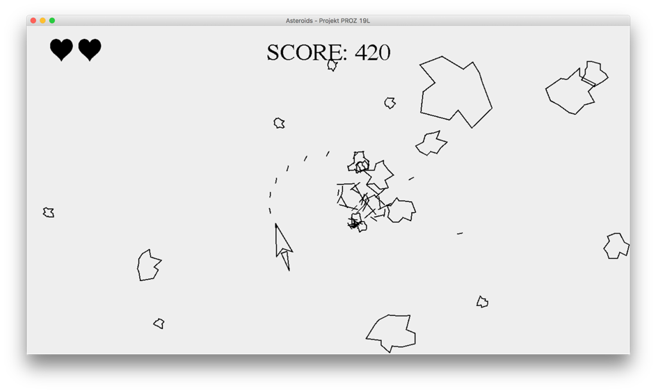
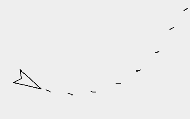
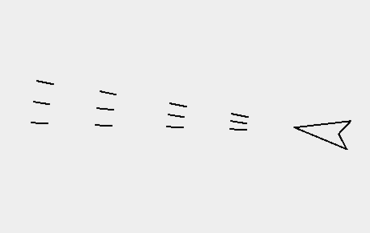
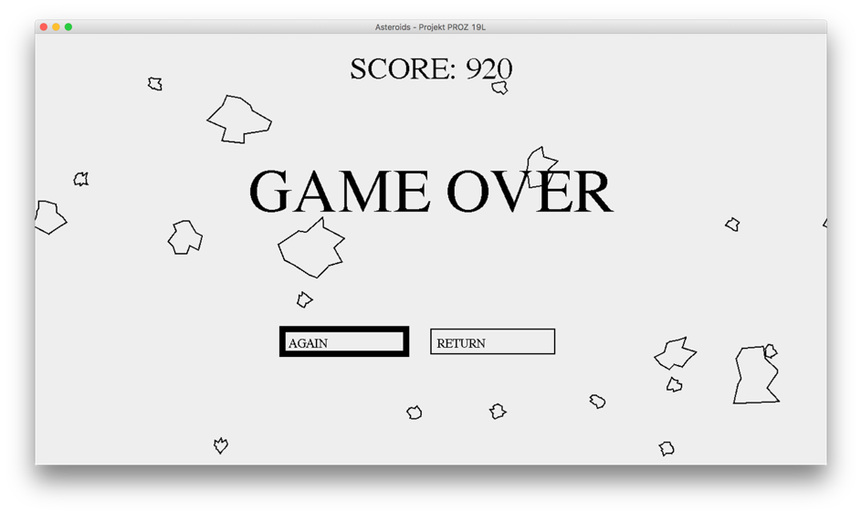

[PL]
# Projekt PROZ 19L
# ASTEROIDS – DOKUMENTACJA
## Robert Dudziński

## PORUSZANIE SIĘ PO MENU

W menu można się poruszać za pomocą strzałek lub klawiszy WSAD. Program zaznacza aktualnie wybrany przycisk – można go wybrać poprzez wciśnięcie klawisza ENTER.

## MENU GŁÓWNE

Menu główne pozwala rozpoczynać nową grę jak i umożliwia wyjście z programu. 

## ROZGRYWKA

## STEROWANIE

W – uruchom ciąg do przodu
S – uruchom ciąg do tyłu (jest mniejszy niż ciąg do przodu)
A – obróć statek w lewo
D – obróć statek w prawo
SPACJA – korzystanie z broni
ESC – pauza gry

## Korzystanie z broni

Za pomocą spacji można strzelać. W zależności od broni możliwy jest jeden z dwóch trybów ognia: pojedynczy i ciągły. Przy strzałach pojedynczych każdy wystrzał jest spowodowany przez wciśnięcie spacji. Dodatkowo każda broń może mieć minimalny czas, który musi minąć, aby móc oddać kolejny strzał (dotyczy to zarówno broni ze strzałami pojedynczymi jak i automatycznymi. 

## Pauza gry

Wciskając klawisz ESC można zapauzować rozgrywkę – gra zostaje zatrzymana aż do momentu wybrania przycisku do kontynuacji gry lub do wyjścia do menu głównego.

## PRZEBIEG GRY

Statek gracza zawsze pojawia się na środku ekranu. Na początku każdego poziomu generują się asteroidy na brzegu ekranu. Do kolejnego poziomu przechodzi się poprzez zniszczenie wszystkich asteroid na obecnym poziomie. Na każdym kolejnym poziomie generuje się jedna więcej asteroida oraz zmienia się broń.

Dostępne bronie (broń po lewej występuje w wariantach: strzelanie automatyczne i pojedyncze)

Aby zniszczyć asteroidę, należy trafić ją pociskiem. Jest kilka rozmiarów asteroid. Na samym początku generują się tylko duże asteroidy. Gdy trafi się w asteroidę, która nie jest najmniejszego rozmiaru to rozpada się ona na dwie asteroidy o mniejszym rozmiarze.

Gracz przechodząc na kolejne poziomy może dostać dodatkowe życia (ale nie może mieć więcej żyć niż 5).

## PUNKTACJA

Gracz otrzymuje punkty za niszczenie asteroid oraz za przechodzenie na następne poziomy. Im mniejsza asteroida została zniszczona tym więcej punktów się dostaje. Im na dalszy poziom się przechodzi tym więcej punktów dostaje gracz.

## UI

W lewym górnym rogu wyświetlają się serduszka, których ilość oznacza, ile razy gracz jeszcze może się rozbić o asteroidę.

Po środku na górze znajduję się aktualny wynik.

## KONIEC GRY

Gracz rozpoczyna grę mając 3 życia. Po kolizji z asteroidą gracz traci jedno życie i odradza się na środku ekranu. Przez kilka sekund statek gracza miga – jest to czas, w którym kolizja dla statku jest wyłączona przez co nie występuje sytuacja, że gracz odrodzi się na asteroidzie i od razu zginie. Po straceniu wszystkich żyć, gra kończy się. Można rozpocząć grę od początku lub wrócić do głównego menu.

